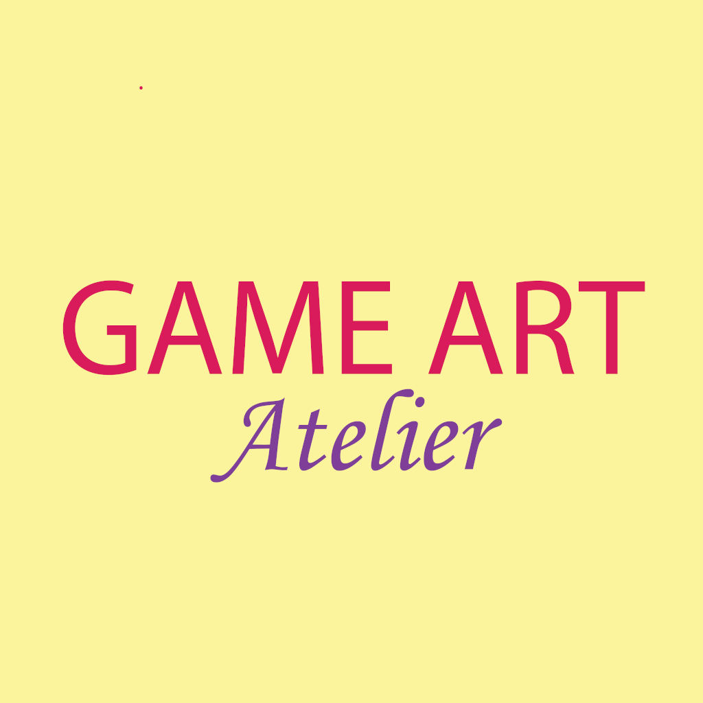

# Game-Art-Atelier
A Video Game Art Gallery: My Final Project for the Course "Mobile Programming" of Haaga-Helia UAS

<div id="top"></div>
<!--
*** Thanks for checking out the Best-README-Template. If you have a suggestion
*** that would make this better, please fork the repo and create a pull request
*** or simply open an issue with the tag "enhancement".
*** Don't forget to give the project a star!
*** Thanks again! Now go create something AMAZING! :D
-->

<!-- PROJECT SHIELDS -->
<!--
*** I'm using markdown "reference style" links for readability.
*** Reference links are enclosed in brackets [ ] instead of parentheses ( ).
*** See the bottom of this document for the declaration of the reference variables
*** for contributors-url, forks-url, etc. This is an optional, concise syntax you may use.
*** https://www.markdownguide.org/basic-syntax/#reference-style-links
-->
[![Contributors][contributors-shield]][contributors-url]
[![Forks][forks-shield]][forks-url]
[![Stargazers][stars-shield]][stars-url]
[![Issues][issues-shield]][issues-url]
[![MIT License][license-shield]][license-url]


<!-- PROJECT LOGO -->
<br />
<div align="center">
  <a href="https://img.shields.io/github/stars/hffriman/Game-Art-Atelier">
    
  </a>

<h3 align="center">Game Art Atelier</h3>

  <p align="center">
    A Gallery Dedicated to Visual Arts in Video Games
    <br />
    <a href="https://github.com/hffriman/Game-Art-Atelier"><strong>Explore the docs »</strong></a>
    <br />
    <br />
    <a href="https://expo.dev/@hffriman/Game-Art-Atelier">View Demo</a>
    ·
    <a href="https://github.com/hffriman/Game-Art-Atelier/issues">Report Bug</a>
    ·
    <a href="https://github.com/hffriman/Game-Art-Atelier/issues">Request Feature</a>
  </p>
</div>


<!-- TABLE OF CONTENTS -->
<details>
  <summary>Table of Contents</summary>
  <ol>
    <li>
      <a href="#about-the-project">About The Project</a>
      <ul>
        <li><a href="#built-with">Built With</a></li>
      </ul>
    </li>
    <li>
      <a href="#getting-started">Getting Started</a>
      <ul>
        <li><a href="#prerequisites">Prerequisites</a></li>
        <li><a href="#installation">Installation</a></li>
      </ul>
    </li>
    <li><a href="#usage">Usage</a></li>
    <li><a href="#roadmap">Roadmap</a></li>
    <li><a href="#contributing">Contributing</a></li>
    <li><a href="#license">License</a></li>
    <li><a href="#contact">Contact</a></li>
    <li><a href="#acknowledgments">Acknowledgments</a></li>
  </ol>
</details>


<!-- ABOUT THE PROJECT -->
## About The Project

[![Product Name Screen Shot][product-screenshot]]

### Introduction

"Game Art Atelier" is dedicated to people who appreciate the visual part of video games.

With this application, you can search for production artworks, game covers and character designs, as well as save them to three Favourites lists (Favourite Artworks, Favourite Covers, Favourite Covers). 

You can always delete things you have saved from the Favourites lists. After deletion of each object, you will be automatically sent back to the front page in order to update the changes.

You can also use this app to send feedback to me (the developer) by using the Feedback screen. With this function, you can write the subject and the content of your feedback in the text boxes -- after pressing the Send button, you will be redirected to your own mail application, where you have to only finish the sending of the email. Please make sure you have a mail application in your phone if you want to use the feedback function.


### Screenshots


#### IOS


#### Android
 


### Built With

* [React.js](https://reactjs.org/)
* [React Native](https://reactnative.dev/)
* [Expo](https://expo.dev/)
* [IGDB](https://api-docs.igdb.com/#about)

<p align="right">(<a href="#top">back to top</a>)</p>


<!-- GETTING STARTED -->
## Getting Started

### Prerequisites

If you want to run this project in your app, there are things you have to do first:

**1. IGDB API (for API fetching):**
  - You must create a Twitch account and register your own app in order to get your own **Client ID** and **Client Secret**
  - With Cliend ID and Client Secret, you will get your own **Access Token** and **Token Type**
  - All the necessary instructions are here: https://api-docs.igdb.com/#account-creation

**2. Expo app (for using the app in your phone)**
  - Install the Expo app to your phone
  - Google Play (Android) and App Store (iOS)   

**3. Expo Cli (for making the app usable from your phone)**
  - Install the Expo Cli in your computer from the command line 
  * npm
      ```sh
      npm install –g expo-cli
      ```
### Installation

1. Clone the repo
   ```sh
   git clone https://github.com/github_username/repo_name.git
   ```
2. Install NPM packages
   ```sh
   npm install
   ```
3. Create a file .env
3. Enter your **Client ID** ** in `config.js`
   ```js
   const API_KEY = 'ENTER YOUR API';
   ```

<p align="right">(<a href="#top">back to top</a>)</p>


<!-- USAGE EXAMPLES -->
## Usage

Use this space to show useful examples of how a project can be used. Additional screenshots, code examples and demos work well in this space. You may also link to more resources.

_For more examples, please refer to the [Documentation](https://example.com)_

<p align="right">(<a href="#top">back to top</a>)</p>


<!-- ROADMAP -->
## Roadmap

- [] Feature 1
- [] Feature 2
- [] Feature 3
    - [] Nested Feature

See the [open issues](https://github.com/github_username/repo_name/issues) for a full list of proposed features (and known issues).

<p align="right">(<a href="#top">back to top</a>)</p>


<!-- CONTRIBUTING -->
## Contributing

Contributions are what make the open source community such an amazing place to learn, inspire, and create. Any contributions you make are **greatly appreciated**.

If you have a suggestion that would make this better, please fork the repo and create a pull request. You can also simply open an issue with the tag "enhancement".
Don't forget to give the project a star! Thanks again!

1. Fork the Project
2. Create your Feature Branch (`git checkout -b feature/AmazingFeature`)
3. Commit your Changes (`git commit -m 'Add some AmazingFeature'`)
4. Push to the Branch (`git push origin feature/AmazingFeature`)
5. Open a Pull Request

<p align="right">(<a href="#top">back to top</a>)</p>


<!-- LICENSE -->
## License

Distributed under the MIT License. See `LICENSE.txt` for more information.

<p align="right">(<a href="#top">back to top</a>)</p>


<!-- CONTACT -->
## Contact

Your Name - [@twitter_handle](https://twitter.com/twitter_handle) - email@email_client.com

Project Link: [https://github.com/github_username/repo_name](https://github.com/github_username/repo_name)

<p align="right">(<a href="#top">back to top</a>)</p>


<!-- ACKNOWLEDGMENTS -->
## Acknowledgments

* []()
* []()
* []()

<p align="right">(<a href="#top">back to top</a>)</p>


<!-- MARKDOWN LINKS & IMAGES -->
<!-- https://www.markdownguide.org/basic-syntax/#reference-style-links -->
[contributors-shield]: https://img.shields.io/github/contributors/hffriman/Game-Art-Atelier.svg?style=for-the-badge
[contributors-url]: https://github.com/hffriman/Game-Art-Atelier/graphs/contributors
[forks-shield]: https://img.shields.io/github/forks/hffriman/Game-Art-Atelier.svg?style=for-the-badge
[forks-url]: https://github.com/hffriman/Game-Art-Atelier/network/members
[stars-shield]: https://img.shields.io/github/stars/hffriman/Game-Art-Atelier.svg?style=for-the-badge
[stars-url]: https://github.com/hffriman/Game-Art-Atelier/stargazers
[issues-shield]: https://img.shields.io/github/issues/hffriman/Game-Art-Atelier.svg?style=for-the-badge
[issues-url]: https://github.com/hffriman/Game-Art-Atelier/issues
[license-shield]: https://img.shields.io/github/license/hffriman/Game-Art-Atelier.svg?style=for-the-badge
[license-url]: https://github.com/hffriman/Game-Art-Atelier/blob/master/LICENSE.txt
[product-screenshot]: images/screenshot.png
